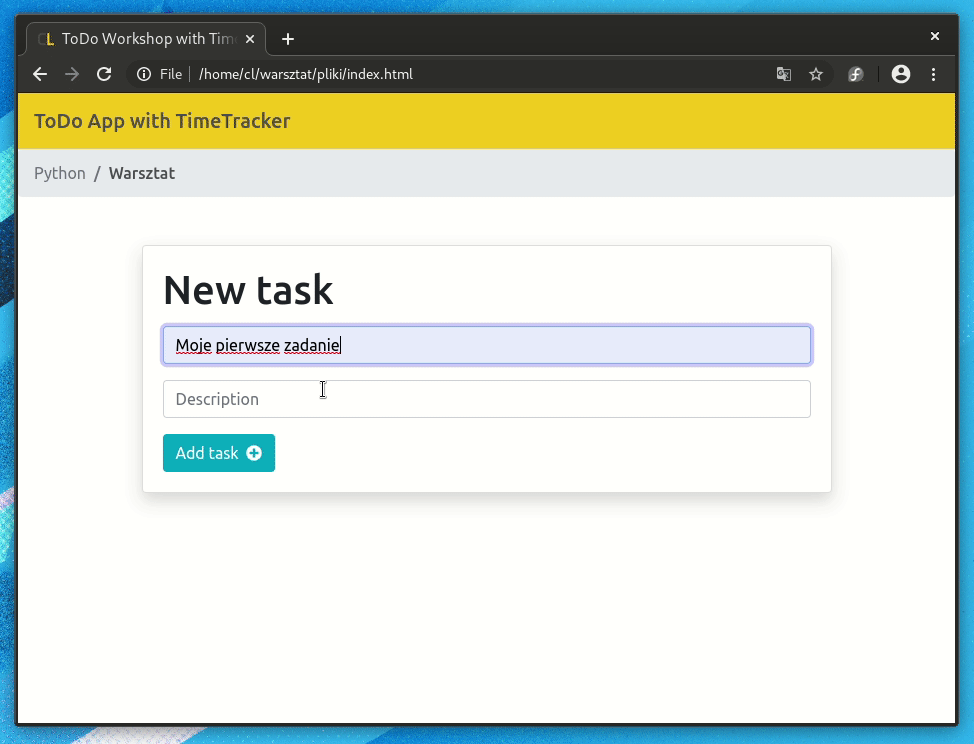
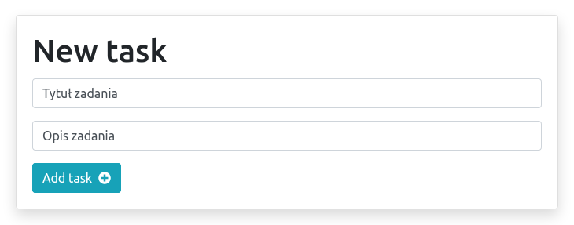
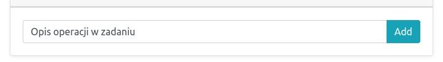
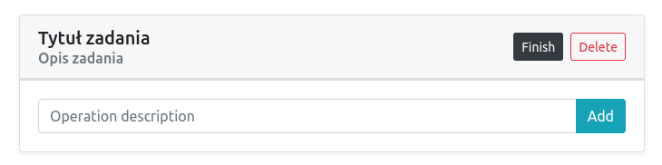
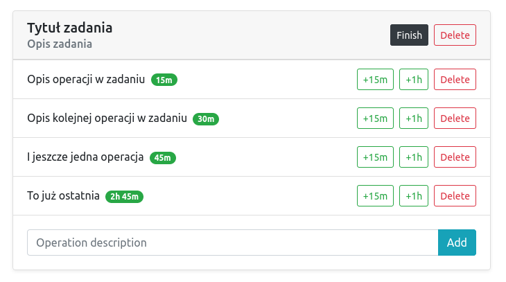
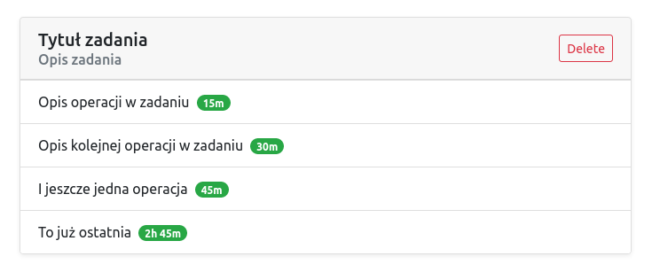

# JavaScript Basic ToDo List
This is a javascript todo list application. You can add/remove todos.
The UI is built using HTML, CSS the backend is all done using Javascript and endpoint from CodersLab.

## You can test it: *[DEMO ToDo List](http://js-todolist.michalszyba.eu)*

### You can add new task

### You can add operations to task

### Your task

### You can add time to operations (`+15 min` or `+1 h`)

### You can finish task

### Enjoy!!!